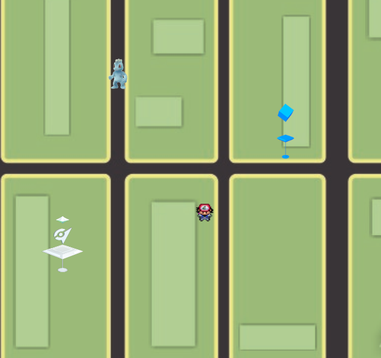
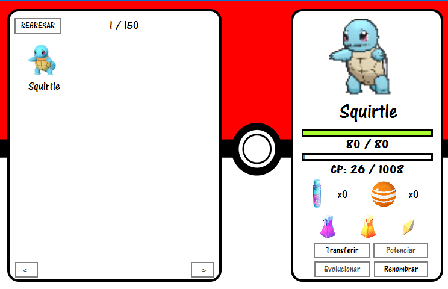

# Pokemon Go UPC
---
Game based on Nintendo's Pokemon Go game and developed as final project for the programming 2 course at UPC

#### Instructions: 
- Load game		=>	'C'
- Save game 		=>	'G'
- Open backpack		=>	'M'
- Special minigame	=>	'TAB'
- Close game		=>	'ESC'
- Change page		=>	'Enter'
- Use bike    =>	'B'
- Move player		=>	'W' 'A' 'S' 'D'
- Select Pokemon to capture  => Mouse click

---

 

 

### Made by: <a href = "https://github.com/RodrigoAGM">@RodrigoAGM </a> :peru:
